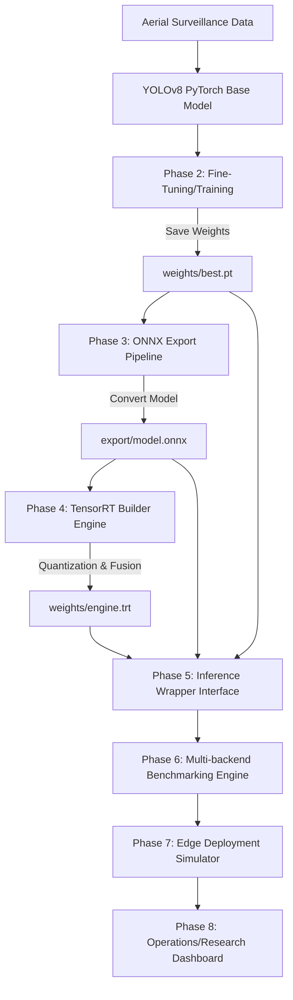

# SentinelEdge: Real-Time Edge AI Optimization Pipeline for UAV Surveillance

[](https://www.nvidia.com/en-us/autonomous-machines/embedded-systems/)
[](#)
[](#)

SentinelEdge is a modular, defense-grade Systems + Optimization pipeline designed to fine-tune, optimize, benchmark, and deploy real-time object detection models for Unmanned Aerial Vehicle (UAV) surveillance environments.

---

## 1. System Architecture



## 2. Directory Structure

```text
SentinelEdge/
├── datasets/          # Raw and formatted drone/UAV detection datasets
├── models/            # Dynamic model definitions & runtime downloads
├── weights/           # Weights storage (.pt, .onnx, .engine)
├── export/            # Exporters & structural checks
├── benchmarks/        # Evaluation and benchmark runner components
├── inference/         # Abstract & custom inference backends (Torch, ORT, TRT)
├── deployment/        # Low-power and compute constraint simulator
├── dashboards/        # Streamlit interface components
├── utils/             # Loggers, configuration parsers, and performance timing
├── configs/           # Configuration files for training & build targets
├── logs/              # Application runtime logs
├── results/           # Benchmark outputs (CSV metrics & plots)
└── docs/              # Research documentation & evaluation sheets
```

## 3. Environment Setup & Prerequisites

```bash
# Clone the repository
git clone https://github.com/example/SentinelEdge.git
cd SentinelEdge

# Install prerequisites
pip install -r requirements.txt
```

> [!NOTE]
> If building TensorRT engines, please ensure you have the appropriate NVIDIA CUDA toolkit, cuDNN, and TensorRT libraries installed. On NVIDIA Jetson platforms, these are pre-packaged via JetPack.
